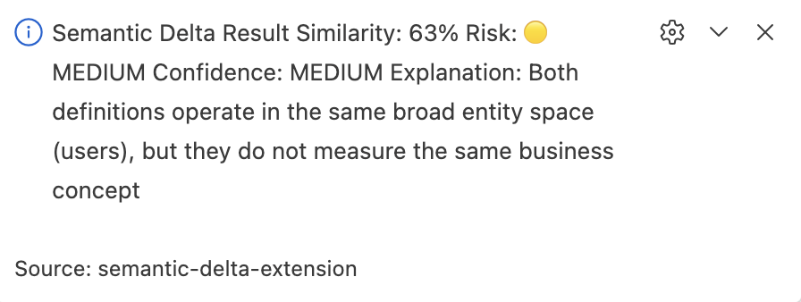

# semantic-delta-extension

## 🚨 What this is

A VS Code extension for semantic-delta-detector — compare SQL metrics directly in your editor.

Detect when two SQL queries look similar but represent different business metrics.

---

## 🔌 Powered by
https://github.com/Ryukanchi/semantic-delta-detector

---

## ⚡ How it works
- Run command: Semantic Delta: Run Demo
- Paste two SQL queries
- Instantly get:
  - similarity
  - risk level
  - confidence
  - explanation

---

## 🧪 Example

Query A:
SELECT COUNT(*) FROM users

Query B:
SELECT COUNT(*) FROM users WHERE active = true

Result:
- 🟡 Medium risk due to filter difference

---

## 💡 Why it matters
Catch metric definition drift before it reaches dashboards and business decisions.

---

## 📦 Status
Early prototype powered by the core semantic-delta-detector engine.

---

## 🧠 Architecture
This extension is a thin interface layer on top of the semantic-delta-detector core engine.

---

## 🔌 VS Code Extension
Use the detector directly in your editor:
https://github.com/Ryukanchi/semantic-delta-extension
