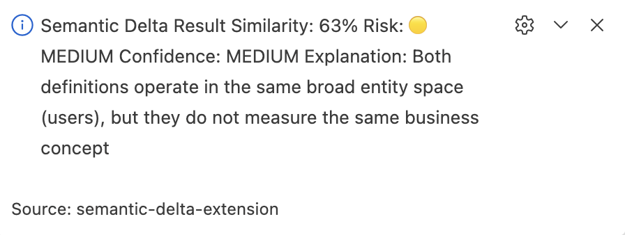

# semantic-delta-extension

## What This Is



A VS Code extension for running semantic-delta-detector directly in your editor.

The extension is intentionally thin: it collects two SQL queries, calls the core detector package, and opens the result as a Markdown report.

Core detector repo: https://github.com/Ryukanchi/semantic-delta-detector

## Why It Matters

Same-looking SQL can mean different KPIs. This extension helps catch metric definition drift before teams compare incompatible dashboard numbers.

## How It Works

- Run `Semantic Delta: Run Example` for a Quick Pick of built-in demo cases.
- Select an example to open a Markdown report.
- Run `Semantic Delta: Run Demo` to enter custom Query A and Query B.
- The extension calls `semantic-delta-detector` for the semantic comparison.

The report includes risk and confidence separately, every finding with category
and impact, explanation, recommendation, evidence sources, parser limitations,
business meaning, and both input queries. Similarity is a heuristic score, not
confidence or proof of equivalence. No findings do not establish safety or
semantic equivalence, and no reported limitations do not establish full SQL
coverage. SQL is analyzed locally and is never executed.

Empty or whitespace-only inputs are rejected before loading the engine. Import
or analysis failures produce an error notification with risk and confidence
not assessed, never a synthetic low-risk report. Engine-returned limitations
remain part of a semantic result. The current public API has no structured
exception taxonomy: other thrown engine errors (including rejection of a
nonempty comment-only input) are treated as failed operations rather than
classified by parsing error-message text. This extension is not a SQL validator.

## Development setup

Open this repository itself in VS Code. Development checks were run with
Node 24.18.0. The declared VS Code minimum is 1.110.0; its Extension Host
was also tested with its bundled Node 22.22.0. Then run:

```sh
npm ci
npm test
npm run test:extension
```

`npm test` verifies the pinned engine archive, compiles the extension, runs
lint, and executes the Node integration/unit tests against the installed real
engine plus explicit failure fixtures. `npm run test:extension` compiles and
lints, then downloads VS Code 1.110.0 into `.vscode-test` and runs the Extension
Host tests with isolated profiles. These tests cover activation, command
registration, and opening a real limited analysis as a Markdown document.
They do not automate typing into InputBox or QuickPick.

Use F5 to launch the development extension. `npm run compile` builds `out/`;
`npm run watch` rebuilds while editing. No neighboring engine checkout is
needed. The engine is the unchanged, checksum-verified 1.0.2 archive stored in
`vendor/`; its dependencies are locked by `package-lock.json`. See
[artifact provenance and upgrade procedure](vendor/README.md). The public npm
package is not assumed to be available. No publishing step is required.

## Example

Query A:

```sql
SELECT COUNT(DISTINCT user_id) FROM events WHERE event = 'login'
```

Query B:

```sql
SELECT COUNT(*) FROM events WHERE event = 'login'
```

Expected interpretation:

- Query A counts unique users with login events.
- Query B counts login event rows.
- This is high risk because repeated events by the same user can make row counts larger than user counts.

## Architecture

- `semantic-delta-extension` owns the VS Code command and Markdown rendering.
- `semantic-delta-detector` owns semantic analysis and risk interpretation.
- The extension does not duplicate detector logic.
- `src/comparison.ts` loads the public root API and preserves its public result type.
- `src/report.ts` renders the result without recalculating risk or confidence.
- `src/reportController.ts` separates validation, operational errors, and result delivery.

## Status

Phase 1 hardens the existing input/example commands and Markdown output. There
is no editor/file Before/After command, WebView, Git integration, or PostgreSQL
mode yet. Comparison remains synchronous inside the Extension Host; large
inputs can block it. Cancellation and full-analysis isolation are not provided.

This is not presented as production-ready or marketplace-published. VSIX
packaging and installation outside the development environment remain to be
validated. Existing engine limitations and known domain-specific explanation
wording remain unchanged; the extension does not replace them with its own
semantic rules.
